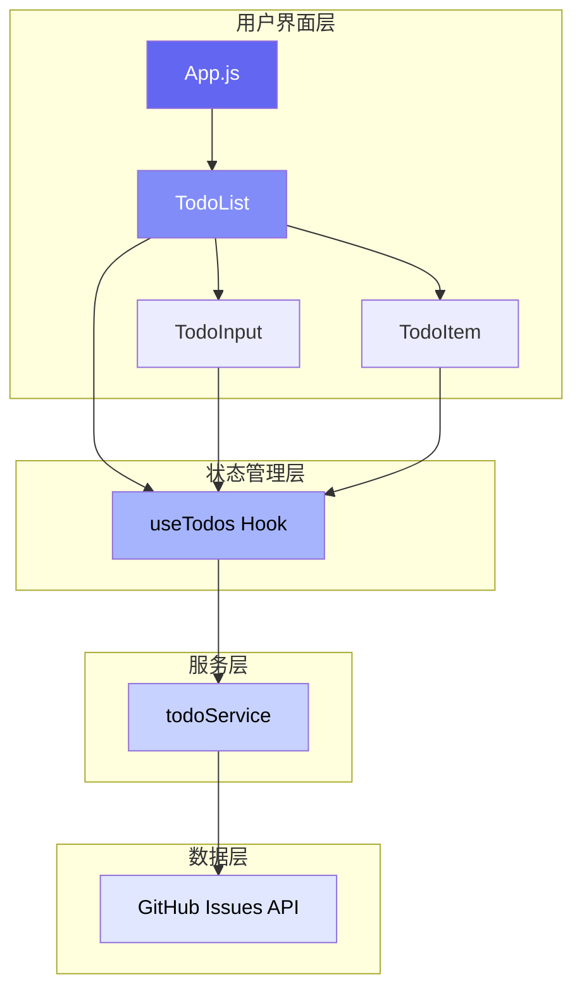
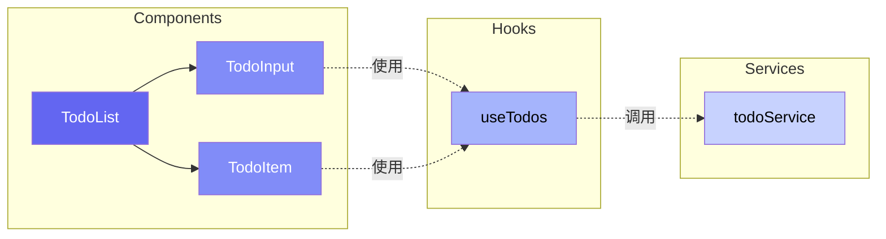
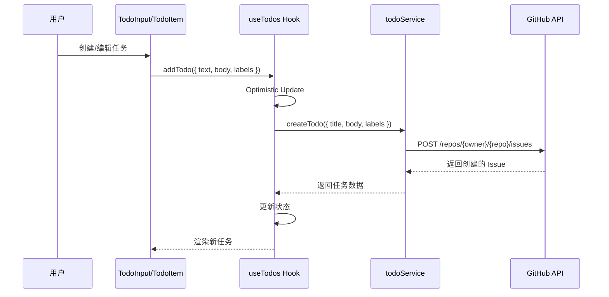
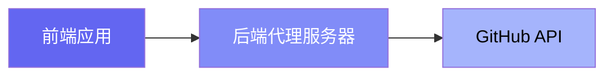

# 现代化待办清单应用

> 基于 React + GitHub Issues API 的现代化任务管理应用，支持标签系统、黑暗模式和富文本编辑。


## 📋 目录

- [功能特性](#功能特性)
- [技术栈](#技术栈)
- [架构设计](#架构设计)
- [快速开始](#快速开始)
- [项目结构](#项目结构)
- [核心功能](#核心功能)
- [主题系统](#主题系统)
- [API 集成](#api-集成)
- [开发指南](#开发指南)

## ✨ 功能特性

### 核心功能
- ✅ **任务管理** - 创建、编辑、删除待办事项
- ✅ **任务状态** - 标记任务完成/未完成
- ✅ **富文本编辑** - 支持格式化文本、列表、链接等
- ✅ **标签系统** - 多标签分类，GitHub 标签颜色同步
- ✅ **搜索过滤** - 快速查找任务
- ✅ **数据持久化** - 基于 GitHub Issues API
- 🆕 **优先级管理** - 高/中/低三级优先级，彩色渐变标签
- 🆕 **截止日期** - 日期选择器，自动标识逾期任务
- 🆕 **批量操作** - 多选任务，批量完成或删除

### UI/UX 特性
- 🌓 **黑暗/白天模式** - 完整主题切换支持
- 📱 **响应式设计** - 适配桌面和移动端
- ✨ **现代化 UI** - 使用 Ant Design 组件库
- 🎨 **动画效果** - 流畅的交互动画
- 👁️ **优化视觉** - 高对比度、清晰可读
- 🆕 **任务统计** - 实时显示任务数据统计
- 🆕 **多种排序** - 按时间、优先级、日期、标题排序
- 🆕 **快捷键** - 提升操作效率的键盘快捷键

## 🛠 技术栈

### 前端框架
- **React 18** - UI 框架
- **Vite** - 构建工具和开发服务器
- **Ant Design 4** - UI 组件库

### 核心库
- **Axios** - HTTP 客户端
- **React Quill** - 富文本编辑器
- **GitHub REST API** - 数据存储

### 开发工具
- **ESLint** - 代码质量检查
- **CSS Variables** - 主题系统

## 🏗 架构设计

### 整体架构



### 组件架构



### 数据流



## 🚀 快速开始

### 前置要求

- Node.js >= 14.0.0
- npm 或 yarn
- GitHub Personal Access Token

### 安装步骤

1. **克隆项目**
```bash
git clone <repository-url>
cd todo-app
```

2. **安装依赖**
```bash
npm install
```

3. **配置 GitHub Token**

编辑 `src/services/todoService.js`，替换你的 GitHub Token：

```javascript
const REPO_OWNER = 'your-username';
const REPO_NAME = 'your-repo';
// 配置你的 token
```

> ⚠️ **安全提醒**: 生产环境应使用后端代理，不要在客户端暴露 token

4. **启动开发服务器**
```bash
npm run dev
```

5. **访问应用**
```
http://localhost:5173/todoApp/
```

### 构建生产版本

```bash
npm run build
```

## 📁 项目结构

```
todo-app/
├── src/
│   ├── components/          # React 组件
│   │   ├── TodoList.js     # 任务列表容器
│   │   ├── TodoInput.js    # 任务输入组件
│   │   └── TodoItem.js     # 单个任务组件
│   ├── hooks/              # 自定义 Hooks
│   │   └── useTodos.js     # 任务管理 Hook
│   ├── services/           # API 服务
│   │   └── todoService.js  # GitHub API 集成
│   ├── App.js              # 根组件
│   ├── App.css             # 全局样式
│   ├── index.js            # 入口文件
│   └── index.css           # 基础样式
├── index.html              # HTML 模板
├── vite.config.js          # Vite 配置
└── package.json            # 项目配置
```

## 🎯 核心功能

### 1. 任务管理

**创建任务**
- 输入任务标题（必填）
- 添加富文本描述（可选）
- 选择多个标签（可选）

**编辑任务**
- 点击编辑按钮进入编辑模式
- 支持内联编辑标题和描述
- 实时同步到 GitHub Issues

**删除任务**
- 二次确认删除操作
- 永久删除对应的 GitHub Issue

### 2. 标签系统

**标签功能**
- 从 GitHub 仓库自动获取标签
- 多标签选择
- 标签颜色自动同步
- 黑暗模式下优化可读性

**标签配置**
在 GitHub 仓库中配置标签：
1. 进入仓库 Settings > Labels
2. 创建或编辑标签
3. 设置标签名称和颜色
4. 应用会自动同步

### 3. 富文本编辑

使用 React Quill 编辑器，支持：
- **文本格式**: 粗体、斜体、下划线、删除线
- **标题**: H1, H2, H3
- **列表**: 有序列表、无序列表
- **链接**: 添加超链接
- **清除格式**: 一键清除所有格式

### 4. 搜索过滤

- 实时搜索任务标题和内容
- 按状态筛选（全部/未完成/已完成）
- 高性能搜索实现

## 🎨 主题系统

### 颜色变量

```css
:root {
  --primary-color: #6366f1;      /* 主色调 */
  --bg-body: #f3f4f6;            /* 背景色 */
  --bg-card: #ffffff;            /* 卡片背景 */
  --text-primary: #1f2937;       /* 主文本色 */
  --border-color: #e5e7eb;       /* 边框色 */
}

[data-theme='dark'] {
  --primary-color: #818cf8;
  --bg-body: #111827;
  --bg-card: #1f2937;
  --text-primary: #f3f4f6;
  --border-color: #374151;
}
```

### 主题切换

主题状态保存在 `localStorage`，页面刷新后保持选择。

```javascript
// 自动读取保存的主题
const savedTheme = localStorage.getItem('theme') || 'light';
document.documentElement.setAttribute('data-theme', savedTheme);
```

## 🔌 API 集成

### GitHub Issues API

**端点配置**
```javascript
const API_BASE = 'https://api.github.com';
const REPO_OWNER = 'your-username';
const REPO_NAME = 'your-repo';
```

**主要 API 方法**

| 方法 | 端点 | 说明 |
|------|------|------|
| `getTodos()` | `GET /repos/{owner}/{repo}/issues` | 获取所有任务 |
| `createTodo()` | `POST /repos/{owner}/{repo}/issues` | 创建新任务 |
| `updateTodo()` | `PATCH /repos/{owner}/{repo}/issues/{number}` | 更新任务 |
| `deleteTodo()` | `PATCH /repos/{owner}/{repo}/issues/{number}` | 删除任务（关闭） |
| `getLabels()` | `GET /repos/{owner}/{repo}/labels` | 获取标签列表 |

**数据映射**

GitHub Issue → Todo Item:
```javascript
{
  id: issue.id,
  githubNumber: issue.number,
  text: issue.title,
  body: issue.body,
  labels: issue.labels.map(l => ({ id, name, color })),
  completed: issue.state === 'closed',
  createdAt: issue.created_at,
  updatedAt: issue.updated_at
}
```

## 💻 开发指南

### 本地开发

```bash
# 安装依赖
npm install

# 启动开发服务器（支持热更新）
npm run dev

# 构建生产版本
npm run build

# 预览生产构建
npm run preview
```

### 代码规范

- 使用 ESLint 进行代码检查
- 遵循 React Hooks 最佳实践
- 组件采用函数式编程
- 使用 CSS 变量实现主题

### 性能优化

1. **代码分割**: Vite 自动进行代码分割
2. **懒加载**: 组件按需加载
3. **Memo 优化**: 使用 `useCallback` 和 `useMemo`
4. **乐观更新**: UI 先更新，后同步 API

### 调试

启用调试日志：
```javascript
// useTodos.js 中已添加详细日志
console.log('[addTodo] Starting with:', { text, body, labels });
```

## 🖼️ 应用截图

### 白天模式


### 黑暗模式


### 标签选择器


## 🔒 安全建议

### Token 安全

**当前实现（开发环境）**:
- Token 在客户端代码中（不安全）
- 仅适用于个人开发和测试

**生产环境建议**:


实现后端代理：
```javascript
// Express 示例
app.post('/api/todos', async (req, res) => {
  const response = await axios.post(
    `https://api.github.com/repos/${owner}/${repo}/issues`,
    req.body,
    {
      headers: {
        Authorization: `token ${process.env.GITHUB_TOKEN}`
      }
    }
  );
  res.json(response.data);
});
```

## 🚦 路线图

### 已完成 ✅
- [x] 基础任务 CRUD
- [x] 富文本编辑
- [x] 标签系统
- [x] 黑暗模式
- [x] 响应式设计
- [x] 搜索过滤
- [x] 乐观更新

### 已完成 ✅ (最新更新)
- [x] **任务优先级** - 高/中/低三级优先级，渐变标签显示
- [x] **截止日期** - 日期选择器，自动标识逾期任务
- [x] **任务统计** - 实时统计卡片（总数、进行中、已完成、高优先级）
- [x] **多种排序** - 按创建时间、优先级、截止日期、标题排序
- [x] **批量操作** - 多选、批量完成、批量删除
- [x] **快捷键支持** - Ctrl/Cmd+K 快速添加，Ctrl/Cmd+A 全选等
- [x] **改进的 UI** - 更现代的渐变效果、动画、阴影

### 计划中 📋
- [ ] 日历视图
- [ ] 拖拽排序
- [ ] 导出功能
- [ ] 任务分组
- [ ] 后端代理（安全性）

## 🤝 贡献

欢迎提交 Issue 和 Pull Request！

## 📄 许可证

MIT License

---

**开发者**: [Your Name]

**最后更新**: 2024-11-24

---

## 🎉 最新更新 (v2.0)

### 新增功能
1. **任务优先级系统** 🔴🟡🟢
   - 三级优先级：高、中、低
   - 彩色渐变标签，视觉效果出众
   - 支持按优先级排序

2. **截止日期管理** 📅
   - 日期选择器，禁止选择过去日期
   - 自动标识逾期任务（红色）
   - 今天到期任务特殊标识（黄色）

3. **任务统计面板** 📊
   - 总任务数
   - 进行中任务数
   - 已完成任务数
   - 高优先级任务数

4. **批量操作** ✅
   - 按住 Ctrl/Cmd 或 Shift 多选任务
   - 批量标记完成
   - 批量删除
   - 全选功能（Ctrl/Cmd + A）

5. **快捷键支持** ⌨️
   - `Ctrl/Cmd + K`: 快速聚焦输入框
   - `Ctrl/Cmd + A`: 全选任务
   - `Esc`: 取消选择
   - `?`: 显示快捷键帮助

6. **多种排序方式** 🔄
   - 按创建时间排序
   - 按优先级排序
   - 按截止日期排序
   - 按标题字母顺序排序

### UI/UX 改进
- 更现代的渐变效果和阴影
- 优先级标签使用渐变背景
- 改进的卡片悬停动画
- 更好的深色模式支持
- 优化的空状态显示
- 批量操作浮动工具栏
- 快捷键提示面板

查看 [FEATURES.md](./FEATURES.md) 了解详细功能说明。

**最后更新**: 2024-11-24
